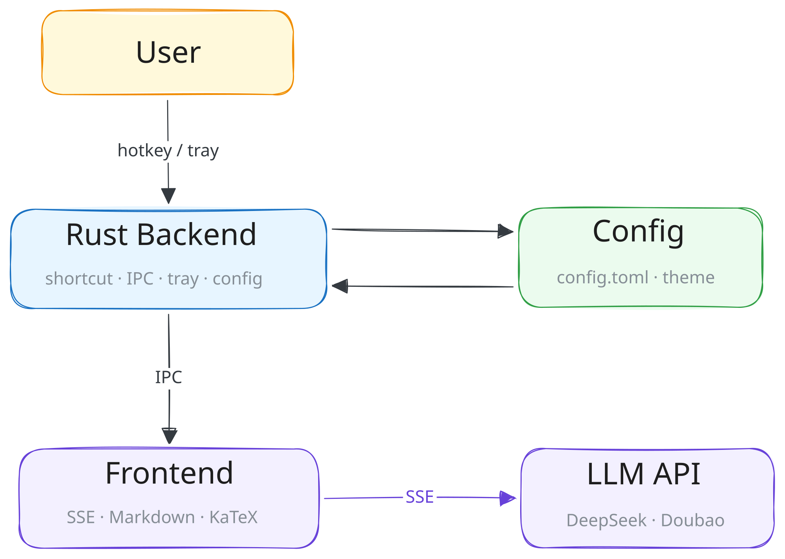

<h1 align="center">
  <br>
  
  <br>
  <sub><sup><b>Translate</b></sup></sub>
</h1>


<p align="center">
    <a href="https://github.com/PengweeWang/translate" target="_blank" style="margin-right: 20px; font-style: normal; text-decoration: none;">
        
    </a>
    <a href="https://github.com/PengweeWang/translate" target="_blank" style="margin-right: 20px; font-style: normal; text-decoration: none;">
        
    </a>
    <a href="https://github.com/PengweeWang/translate" target="_blank" style="margin-right: 20px; font-style: normal; text-decoration: none;">
        
    </a>
    <a href="https://github.com/PengweeWang/translate">
        
    </a>
</p>

## Overview

基于 Tauri v2 的划词翻译桌面应用，支持 DeepSeek / 豆包大模型 API，流式输出 Markdown 渲染。

### 架构



### 技术栈

| 层 | 技术 |
|---|------|
| 桌面框架 | Tauri v2 (Rust) |
| 前端 | 原生 JavaScript + HTML + CSS |
| Markdown 渲染 | marked |
| 公式渲染 | KaTeX (本地) |
| 大模型 API | DeepSeek API / 火山引擎 Ark API |

## 功能

- **划词翻译** — 设置全局快捷键（默认 `Alt+F1`），选中文本后释放快捷键即可翻译
- **智能识别** — 采用 Unicode 分词标准（UAX #29）自动区分单词与句子/段落，支持多语言（英文、中文、法文、俄文、阿拉伯文等），支持自定义 Prompt 模板
- **多模型支持** — 已集成 DeepSeek 与火山引擎豆包，系统托盘一键切换
- **流式输出** — 基于 SSE 实时渲染翻译结果，支持 Markdown 与 LaTeX 公式（KaTeX）
- **系统托盘** — 托盘菜单提供配置管理、模型切换、快捷键开关、开机自启等功能
- **窗口操作** — 无边框圆角面板，支持置顶切换（🔼 按钮），按 `Esc` 关闭，`Alt + 拖拽` 调整位置
- **快捷键重载** — 可在配置文件中自定义快捷键，支持运行时热重载
- **配置管理** — 配置文件位于 `~/.local/translate/config.toml`，支持通过系统编辑器直接编辑
- **配置自动升级** — 新版新增配置字段时自动填充默认值并更新文件，无需手动迁移
- **自动更新** — 启动时自动检查 GitHub Releases 新版本，支持托盘手动检查和开关
- **自定义主题** — 将 CSS 文件放入 `~/.local/translate/theme/` 目录，托盘 Theme 菜单实时切换，兼容 Typora 主题格式

## 使用教程

### 设置 API Key

应用支持 DeepSeek 和火山引擎豆包两种模型。

| 平台 | 申请地址 |
|------|---------|
| DeepSeek | https://platform.deepseek.com/api_keys |
| 火山引擎 | https://console.volcengine.com/ark/region:ark+cn-beijing/apiKey |

> 火山引擎新用户通常会赠送 50 万 token 额度，可供试用。

配置文件首次启动时自动生成于 `~/.local/translate/config.toml`，编辑对应模型的 `api_key` 即可。

### 快捷键

| 操作 | 按键 |
|------|------|
| 划词翻译 | `Alt+F1`（默认，可自定义） |
| 关闭窗口 | `Esc` |
| 拖拽窗口 | `Alt + 鼠标拖拽` |

### 系统托盘

| 菜单项 | 功能 |
|--------|------|
| Config | 用系统编辑器打开配置文件 |
| Model | 切换 DeepSeek / Doubao 模型 |
| Enable/Disable Shortcut | 启用/关闭全局快捷键 |
| Auto Update | 开启/关闭启动时自动检查更新 |
| Check for Updates | 手动检查新版本 |
| Autostart | 开机自启（切换后即时生效） |
| Theme | 切换主题（实时生效） |
| Quit | 完全退出应用 |

### 智能 Prompt 切换

选定文本后自动判断类型：

- **单词**（Unicode 分词后仅 1 个含字母的片段，支持多语言）→ 使用词典释义模版
- **句子/短语**（多个词片段）→ 使用翻译模版

可在配置文件 `config.toml` 中自定义 `word_prompt` 和 `sentence_prompt`。

### 自定义主题

将 `.css` 文件放入 `~/.local/translate/theme/` 目录，重启应用后在托盘 **Theme** 菜单中选择，切换后立即生效。

主题 CSS 使用 `#write` 选择器（兼容 Typora 主题），通过覆盖 `:root` CSS 变量控制界面色彩：

```css
:root {
  --bg-color: #ffffff;          /* 内容区背景 */
  --text-color: #333333;        /* 内容区文字 */
  --dragbar-bg: #f6f8fa;        /* 标题栏背景 */
  --dragbar-border: #e1e4e8;    /* 标题栏分隔线 */
  --dragbar-hover: #eaecef;     /* 标题栏 hover */
  --dragbar-icon-color: #24292e;/* 按钮图标颜色 */
}
```


`docs/theme/` 目录下提供 12 款预置主题，修改自 [imageslr/mweb-themes](https://github.com/imageslr/mweb-themes)，感谢其对本项目的贡献。


## 开发

```bash
# 安装前端依赖
npm install

# 启动开发模式
npm run tauri dev

# 构建发布版本
npm run tauri build
```


## Todo

- [ ] 更加完善的错误处理
- [ ] 更多 API 支持（OpenAI、Claude 等）
- [x] 自定义主题 / 配色
- [ ] 翻译历史记录
- [ ] 支持图片翻译
